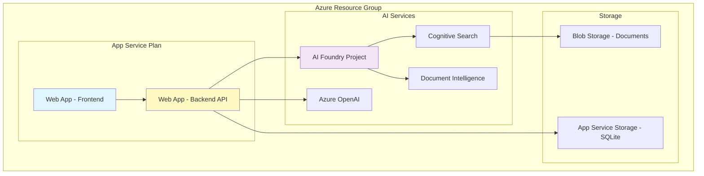

# Azure Deployment Guide - NEURO Project

## Overview

This guide covers deploying the NEURO RAG Backend and Voice Interface to your existing Azure infrastructure with AI Foundry project and App Service.

## Prerequisites

### Existing Azure Resources
- **Resource Group**: Your existing Resource Group
- **AI Foundry Project**: Already created and configured
- **App Service**: Existing for frontend and backend
- **Azure Cognitive Search**: Standard tier or higher
- **Azure OpenAI Service**: With gpt-4o and gpt-4o-mini deployments
- **Azure Document Intelligence**: For Document Layout Skill

### Local Requirements
- Azure CLI installed and authenticated
- Python 3.9+ for local testing
- Git for version control
- VS Code or similar IDE

## Architecture Overview



## Step 1: Prepare Azure Resources

### 1.1 Configure AI Foundry Project

```bash
# Set your subscription
az account set --subscription "YOUR_SUBSCRIPTION_ID"

# Variables
RESOURCE_GROUP="your-resource-group"
AI_FOUNDRY_PROJECT="your-ai-foundry-project"
SEARCH_SERVICE="your-search-service"
```

### 1.2 Create Search Index

```bash
# Navigate to backend directory
cd NEURO_RAG_BACKEND

# Create the semantic chunks index
python scripts/migrate_to_chunks.py
```

### 1.3 Import Documents in AI Foundry

1. Navigate to [Azure AI Foundry](https://ai.azure.com)
2. Open your project
3. Go to: **Agents → Setup → Knowledge → + Add**
4. Configuration:
   ```
   Index Name: neuro-rag-semantic-chunks
   Document Layout: Enabled
   Chunking Strategy: Semantic
   Chunk Size: 1000 tokens
   Overlap: 200 tokens
   ```
5. Import documents from your Blob Storage

## Step 2: Deploy Backend to App Service

### 2.1 Prepare Backend for Deployment

Create `startup.sh` in NEURO_RAG_BACKEND:

```bash
#!/bin/bash
gunicorn -w 4 -k uvicorn.workers.UvicornWorker \
  --bind 0.0.0.0:8000 \
  --timeout 120 \
  --access-logfile '-' \
  --error-logfile '-' \
  src.api.main:app
```

Create `requirements-prod.txt`:

```txt
# Include all from requirements.txt plus:
gunicorn==21.2.0
uvicorn[standard]==0.24.0
```

### 2.2 App Service Configuration

```bash
# Variables
APP_SERVICE_BACKEND="neuro-backend"
APP_SERVICE_PLAN="your-app-service-plan"

# Configure Python version
az webapp config set \
  --resource-group $RESOURCE_GROUP \
  --name $APP_SERVICE_BACKEND \
  --linux-fx-version "PYTHON|3.11"

# Set startup command
az webapp config set \
  --resource-group $RESOURCE_GROUP \
  --name $APP_SERVICE_BACKEND \
  --startup-file "startup.sh"
```

### 2.3 Environment Variables

```bash
# Set all environment variables from .env
az webapp config appsettings set \
  --resource-group $RESOURCE_GROUP \
  --name $APP_SERVICE_BACKEND \
  --settings \
    AZURE_OPENAI_STANDARD_ENDPOINT="https://your-openai.openai.azure.com/" \
    AZURE_OPENAI_STANDARD_API_KEY="@Microsoft.KeyVault(SecretUri=https://your-vault.vault.azure.net/secrets/openai-key/)" \
    AZURE_SEARCH_SERVICE_ENDPOINT="https://your-search.search.windows.net" \
    AZURE_SEARCH_INDEX="neuro-rag-semantic-chunks" \
    USE_UNIFIED_AGENT="true" \
    RAG_RETRIEVAL_MODE="agentic" \
    UNIFIED_AGENT_MODEL="gpt-4o-mini" \
    SEMANTIC_CONFIG_NAME="default" \
    RAG_ENABLE_CACHE="true" \
    RAG_MAX_SUBQUERIES="5" \
    ENVIRONMENT="production"
```

### 2.4 Deploy Using ZIP Deploy

```bash
# Package backend
cd NEURO_RAG_BACKEND
zip -r ../backend-deploy.zip . -x "*.pyc" -x "__pycache__/*" -x ".env" -x "data/*"

# Deploy
az webapp deployment source config-zip \
  --resource-group $RESOURCE_GROUP \
  --name $APP_SERVICE_BACKEND \
  --src ../backend-deploy.zip
```

## Step 3: Deploy Frontend to App Service

### 3.1 Prepare Frontend

Create `app_service.py` in root:

```python
import os
from flask import Flask, render_template, jsonify
from flask_cors import CORS

app = Flask(__name__)
CORS(app)

# Backend API URL from environment
BACKEND_URL = os.getenv('BACKEND_URL', 'https://neuro-backend.azurewebsites.net')

@app.route('/')
def index():
    return render_template('voice_live_interface_fede.html')

@app.route('/config')
def config():
    return jsonify({
        'backend_url': BACKEND_URL,
        'environment': os.getenv('ENVIRONMENT', 'production')
    })

if __name__ == '__main__':
    port = int(os.environ.get('PORT', 8080))
    app.run(host='0.0.0.0', port=port)
```

### 3.2 Deploy Frontend

```bash
# Variables
APP_SERVICE_FRONTEND="neuro-frontend"

# Configure Python version
az webapp config set \
  --resource-group $RESOURCE_GROUP \
  --name $APP_SERVICE_FRONTEND \
  --linux-fx-version "PYTHON|3.11"

# Set environment variables
az webapp config appsettings set \
  --resource-group $RESOURCE_GROUP \
  --name $APP_SERVICE_FRONTEND \
  --settings \
    BACKEND_URL="https://$APP_SERVICE_BACKEND.azurewebsites.net" \
    ENVIRONMENT="production"

# Deploy
zip -r frontend-deploy.zip templates app_service.py requirements.txt
az webapp deployment source config-zip \
  --resource-group $RESOURCE_GROUP \
  --name $APP_SERVICE_FRONTEND \
  --src frontend-deploy.zip
```

## Step 4: Configure Networking and Security

### 4.1 Enable Managed Identity

```bash
# Enable system-assigned identity for backend
az webapp identity assign \
  --resource-group $RESOURCE_GROUP \
  --name $APP_SERVICE_BACKEND

# Grant access to Key Vault
az keyvault set-policy \
  --name "your-keyvault" \
  --object-id $(az webapp identity show --resource-group $RESOURCE_GROUP --name $APP_SERVICE_BACKEND --query principalId -o tsv) \
  --secret-permissions get list
```

### 4.2 Configure CORS

```bash
# Allow frontend to call backend
az webapp cors add \
  --resource-group $RESOURCE_GROUP \
  --name $APP_SERVICE_BACKEND \
  --allowed-origins "https://$APP_SERVICE_FRONTEND.azurewebsites.net"
```

### 4.3 Enable Application Insights

```bash
# Create Application Insights
az monitor app-insights component create \
  --app "neuro-insights" \
  --location "eastus" \
  --resource-group $RESOURCE_GROUP \
  --application-type web

# Connect to App Service
az monitor app-insights component connect-webapp \
  --app "neuro-insights" \
  --resource-group $RESOURCE_GROUP \
  --web-app $APP_SERVICE_BACKEND
```

## Step 5: CI/CD Pipeline with GitHub Actions

### 5.1 Create Deployment Workflow

Create `.github/workflows/azure-deploy.yml`:

```yaml
name: Deploy to Azure

on:
  push:
    branches: [main, integracion_rag]
  workflow_dispatch:

env:
  AZURE_WEBAPP_NAME_BACKEND: neuro-backend
  AZURE_WEBAPP_NAME_FRONTEND: neuro-frontend
  PYTHON_VERSION: '3.11'

jobs:
  deploy-backend:
    runs-on: ubuntu-latest
    steps:
    - uses: actions/checkout@v3
    
    - name: Set up Python
      uses: actions/setup-python@v4
      with:
        python-version: ${{ env.PYTHON_VERSION }}
    
    - name: Install dependencies
      run: |
        cd NEURO_RAG_BACKEND
        python -m pip install --upgrade pip
        pip install -r requirements-prod.txt
    
    - name: Run tests
      run: |
        cd NEURO_RAG_BACKEND
        python scripts/validate_chunks.py
    
    - name: Deploy to Azure
      uses: azure/webapps-deploy@v2
      with:
        app-name: ${{ env.AZURE_WEBAPP_NAME_BACKEND }}
        publish-profile: ${{ secrets.AZURE_WEBAPP_PUBLISH_PROFILE_BACKEND }}
        package: ./NEURO_RAG_BACKEND

  deploy-frontend:
    runs-on: ubuntu-latest
    needs: deploy-backend
    steps:
    - uses: actions/checkout@v3
    
    - name: Deploy to Azure
      uses: azure/webapps-deploy@v2
      with:
        app-name: ${{ env.AZURE_WEBAPP_NAME_FRONTEND }}
        publish-profile: ${{ secrets.AZURE_WEBAPP_PUBLISH_PROFILE_FRONTEND }}
        package: .
```

### 5.2 Set GitHub Secrets

```bash
# Download publish profiles
az webapp deployment list-publishing-profiles \
  --resource-group $RESOURCE_GROUP \
  --name $APP_SERVICE_BACKEND \
  --xml > backend-publish.xml

az webapp deployment list-publishing-profiles \
  --resource-group $RESOURCE_GROUP \
  --name $APP_SERVICE_FRONTEND \
  --xml > frontend-publish.xml
```

Add these as secrets in GitHub:
- `AZURE_WEBAPP_PUBLISH_PROFILE_BACKEND`
- `AZURE_WEBAPP_PUBLISH_PROFILE_FRONTEND`

## Step 6: Post-Deployment Validation

### 6.1 Health Check Script

Create `scripts/health_check.py`:

```python
import asyncio
import aiohttp
import json
from datetime import datetime

async def check_health():
    """Validate deployment health"""
    
    backend_url = "https://neuro-backend.azurewebsites.net"
    frontend_url = "https://neuro-frontend.azurewebsites.net"
    
    checks = {
        "backend_api": f"{backend_url}/health",
        "backend_search": f"{backend_url}/test-search",
        "frontend": frontend_url,
    }
    
    results = {}
    async with aiohttp.ClientSession() as session:
        for name, url in checks.items():
            try:
                async with session.get(url, timeout=30) as response:
                    results[name] = {
                        "status": response.status,
                        "ok": response.status == 200,
                        "timestamp": datetime.now().isoformat()
                    }
            except Exception as e:
                results[name] = {
                    "status": "error",
                    "ok": False,
                    "error": str(e),
                    "timestamp": datetime.now().isoformat()
                }
    
    print(json.dumps(results, indent=2))
    return all(r["ok"] for r in results.values())

if __name__ == "__main__":
    success = asyncio.run(check_health())
    exit(0 if success else 1)
```

### 6.2 Performance Test

```bash
# Test response times
curl -w "@curl-format.txt" -o /dev/null -s \
  "https://neuro-backend.azurewebsites.net/ask" \
  -H "Content-Type: application/json" \
  -d '{"question": "ubicacion del equipo DLS-168", "session_id": "test"}'
```

## Step 7: Monitoring and Maintenance

### 7.1 Configure Alerts

```bash
# Create metric alert for high response time
az monitor metrics alert create \
  --name "neuro-high-response-time" \
  --resource-group $RESOURCE_GROUP \
  --scopes "/subscriptions/.../resourceGroups/.../providers/Microsoft.Web/sites/$APP_SERVICE_BACKEND" \
  --condition "avg ResponseTime > 3000" \
  --window-size 5m \
  --evaluation-frequency 1m
```

### 7.2 Log Analytics Queries

Key queries for monitoring:

```kusto
// Average response time
requests
| where timestamp > ago(1h)
| summarize avg(duration) by bin(timestamp, 5m)

// Error rate
requests
| where timestamp > ago(1h)
| summarize 
    total = count(),
    errors = countif(success == false)
by bin(timestamp, 5m)
| extend error_rate = 100.0 * errors / total

// Search performance
customEvents
| where name == "search_execution"
| extend duration = todouble(customDimensions.duration_ms)
| summarize 
    avg_duration = avg(duration),
    p95_duration = percentile(duration, 95)
by bin(timestamp, 5m)
```

## Step 8: Scaling Configuration

### 8.1 Auto-scaling Rules

```bash
# Configure auto-scaling
az monitor autoscale create \
  --resource-group $RESOURCE_GROUP \
  --resource $APP_SERVICE_BACKEND \
  --resource-type Microsoft.Web/serverFarms \
  --name "neuro-autoscale" \
  --min-count 2 \
  --max-count 10 \
  --count 2

# Add CPU-based rule
az monitor autoscale rule create \
  --resource-group $RESOURCE_GROUP \
  --autoscale-name "neuro-autoscale" \
  --condition "Percentage CPU > 70 avg 5m" \
  --scale out 1
```

### 8.2 Performance Optimization

```bash
# Enable Always On
az webapp config set \
  --resource-group $RESOURCE_GROUP \
  --name $APP_SERVICE_BACKEND \
  --always-on true

# Configure min instances
az webapp config set \
  --resource-group $RESOURCE_GROUP \
  --name $APP_SERVICE_BACKEND \
  --min-worker-count 2
```

## Deployment Checklist

### Pre-Deployment
- [ ] AI Foundry project configured
- [ ] Search index created (`neuro-rag-semantic-chunks`)
- [ ] Documents imported with Document Layout Skill
- [ ] Environment variables configured
- [ ] Key Vault secrets created

### Deployment
- [ ] Backend deployed to App Service
- [ ] Frontend deployed to App Service
- [ ] Managed Identity configured
- [ ] CORS settings applied
- [ ] Application Insights connected

### Post-Deployment
- [ ] Health checks passing
- [ ] Response time < 3 seconds
- [ ] Search returning results
- [ ] Voice interface functional
- [ ] Monitoring alerts configured
- [ ] Auto-scaling enabled

## Troubleshooting

### Common Issues

| Issue | Solution |
|-------|----------|
| 503 Service Unavailable | Check App Service logs, increase timeout |
| Empty search results | Verify index name and Document Layout import |
| CORS errors | Update allowed origins in App Service |
| High latency | Enable Always On, increase instance count |
| Memory issues | Upgrade App Service plan to P1V3 or higher |

### Diagnostic Commands

```bash
# View live logs
az webapp log tail \
  --resource-group $RESOURCE_GROUP \
  --name $APP_SERVICE_BACKEND

# Check deployment status
az webapp deployment list-publishing-credentials \
  --resource-group $RESOURCE_GROUP \
  --name $APP_SERVICE_BACKEND

# Test connectivity
az webapp config connection-string list \
  --resource-group $RESOURCE_GROUP \
  --name $APP_SERVICE_BACKEND
```

## Cost Optimization

### Recommended Configuration
- **App Service Plan**: P1V3 (production) or B2 (development)
- **Cognitive Search**: Standard S1
- **Azure OpenAI**: Pay-as-you-go with rate limits
- **Application Insights**: Basic tier with 5GB/month

### Estimated Monthly Costs
- App Service (P1V3): ~$200
- Cognitive Search (S1): ~$250
- Azure OpenAI: ~$500 (based on usage)
- Application Insights: ~$50
- **Total**: ~$1000/month

## Support

For deployment issues:
1. Check Application Insights logs
2. Review deployment logs in Azure Portal
3. Validate all environment variables
4. Test with health check script

---

**NEURO Azure Deployment** | Production-Ready Configuration | Built for YPF