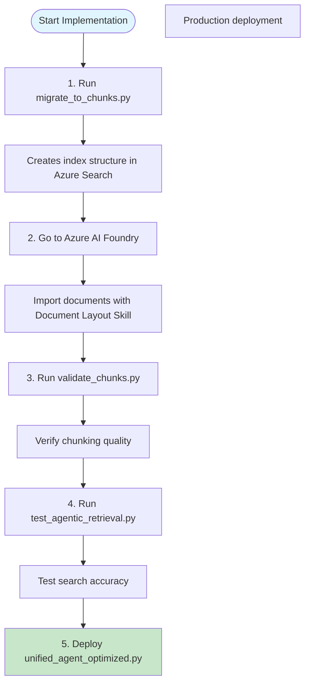

# Script Execution Guide - Step by Step

## Overview
This guide explains exactly when and why to run each script during the implementation process.

## Execution Order and Purpose



## Detailed Script Descriptions

### 1. migrate_to_chunks.py
**When to run**: FIRST - Before any document import

**Purpose**: Creates the index structure that AI Foundry will populate

**What it does**:
```python
# Creates index with these fields:
- chunk_id         # Unique identifier for each chunk
- parent_id        # Links chunk to original document
- chunk_content    # The actual text content
- chunk_index      # Order of chunk in document
- header_1/2/3     # Document structure preservation
- pozo, equipo     # Domain-specific metadata
- text_vector      # Embeddings for vector search
```

**Command**:
```bash
python scripts/migrate_to_chunks.py
```

**Expected output**:
```
Creating semantic chunk index...
SUCCESS: Index created
Index name: neuro-rag-semantic-chunks
Ready for document import in AI Foundry
```

### 2. Azure AI Foundry Document Import
**When to do**: AFTER creating index structure

**Purpose**: Use Document Layout Skill to automatically chunk documents

**What happens**:
- Large PDF/DOCX files are split into semantic chunks
- Each chunk maintains context (headers, metadata)
- Embeddings are generated automatically
- Parent-child relationships preserved

**Process**:
1. Navigate to your AI Foundry project
2. Go to: Agents → Setup → Knowledge → + Add
3. Select index: `neuro-rag-semantic-chunks`
4. Enable Document Layout processing
5. Import documents from storage

### 3. validate_chunks.py
**When to run**: AFTER document import completes

**Purpose**: Ensure chunking was successful before production

**What it validates**:
```python
# Checks performed:
- Chunk sizes (should be 800-1200 chars)
- Parent relationships (no orphans)
- Metadata completeness
- Semantic search functionality
- Vector search capability
```

**Command**:
```bash
python scripts/validate_chunks.py
```

**Expected output**:
```
CHUNK VALIDATION REPORT
=======================
Total chunks: 1,250
Unique documents: 45
Average chunk size: 950 chars
Orphan chunks: 0
STATUS: VALIDATION PASSED
```

### 4. test_agentic_retrieval.py
**When to run**: AFTER validation passes

**Purpose**: Test the complete search pipeline with real queries

**What it tests**:
```python
# Test scenarios:
1. Simple queries (direct lookup)
2. Complex multi-faceted queries
3. Filtered searches
4. Conversational context
5. Performance comparison
```

**Command**:
```bash
python scripts/test_agentic_retrieval.py
```

**Expected results**:
```
Test: Simple Query
  Execution time: 1.2s
  Documents found: 5
  
Test: Complex Multi-Faceted Query
  Execution time: 2.8s
  Subqueries executed: 4
  Documents found: 15
  
Performance vs standard: 35% faster
```

### 5. unified_agent_optimized.py
**When to deploy**: AFTER all tests pass

**Purpose**: Production agent that handles all queries

**Key features**:
```python
# Optimizations:
- Query classification (no LLM for simple queries)
- Pattern-based entity extraction
- Smart caching
- Parallel search execution
- Single LLM call per complex query
```

**Integration**:
```python
# In your main application:
from agents.unified_agent_optimized import OptimizedUnifiedAgent

agent = OptimizedUnifiedAgent()
response = await agent.process_query(
    query="ubicacion del equipo DLS-168",
    session_id="user123"
)
```

## Decision Tree for Script Usage

```
Is your index already created?
├─ No → Run migrate_to_chunks.py
└─ Yes → Skip to AI Foundry import

Are documents already imported and chunked?
├─ No → Import in AI Foundry with Document Layout
└─ Yes → Run validate_chunks.py

Did validation pass?
├─ No → Check import settings, re-import if needed
└─ Yes → Run test_agentic_retrieval.py

Are test results satisfactory?
├─ No → Adjust configuration, re-test
└─ Yes → Deploy unified_agent_optimized.py
```

## Common Issues and Solutions

### Issue: Index creation fails
**Solution**: Check Azure Search service tier (needs Standard+)

### Issue: No chunks after import
**Solution**: Verify Document Layout Skill is enabled in AI Foundry

### Issue: Poor search results
**Solution**: Check semantic configuration name is "default"

### Issue: High latency
**Solution**: Use gpt-4o-mini model, enable caching

## Performance Expectations

| Metric | Before | After | Improvement |
|--------|--------|-------|-------------|
| Response Time | 7-10s | 2-4s | 60% faster |
| LLM Calls | 3-5 | 0-1 | 80% reduction |
| Search Accuracy | 60% | 85% | 40% better |
| Cache Hit Rate | 0% | 40% | New feature |

## Monitoring in Production

After deployment, monitor these metrics:
- Average response time: Target < 3s
- Cache hit rate: Target > 35%
- Error rate: Target < 1%
- Query classification accuracy: Target > 90%

## Next Steps

1. Monitor production metrics for 24 hours
2. Fine-tune cache TTL based on usage patterns
3. Adjust chunk size if needed (600-1200 tokens)
4. Consider adding more metadata fields for better filtering