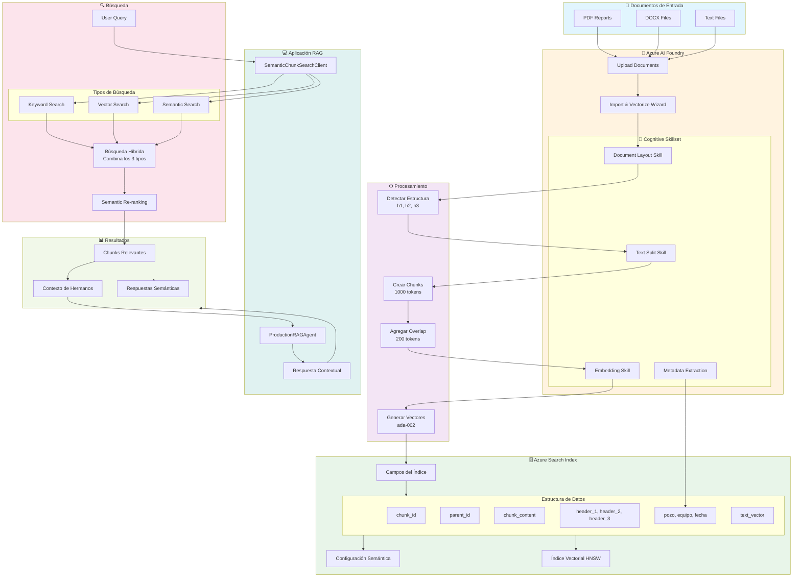

# Guía de Implementación: Chunking Semántico con Document Layout Skill

## Resumen Ejecutivo

Esta guía detalla cómo implementar chunking semántico usando Document Layout Skill de Azure AI Search, optimizado para documentos de pozos petroleros.

## Flujo Completo del Sistema



## Arquitectura de la Solución

El flujo completo implementa:
1. **Ingesta**: Documentos procesados por Document Layout Skill
2. **Chunking Semántico**: División inteligente respetando estructura
3. **Indexación**: Almacenamiento con vectores y metadata
4. **Búsqueda Híbrida**: Combinación de keyword + vector + semántica
5. **RAG Optimizado**: Respuestas contextuales con chunks relacionados

## Paso 1: Configuración en Azure AI Foundry

### 1.1 Crear el Proyecto

1. Accede a [Azure AI Foundry](https://ai.azure.com)
2. Crea un nuevo proyecto o usa uno existente
3. Asegúrate de estar en una región soportada:
   - East US
   - West Europe
   - North Central US

### 1.2 Conectar Azure AI Search

```
Project → Settings → Connected resources → Add connection
→ Azure AI Search → Select your search service
```

### 1.3 Crear Índice con Document Layout

1. Ve a **Agents → Setup → Knowledge → + Add**
2. Selecciona **Azure AI Search**
3. Elige **Create a new index**
4. Configura:
   - Index name: `neuro-rag-semantic-chunks`
   - Search type: **Hybrid (Vector + Keyword + Semantic)**
   - Enable Document Layout: **Yes**

## Paso 2: Configurar el Import Wizard

### 2.1 Data Source

1. Selecciona tu origen de datos:
   - **Azure Blob Storage** (recomendado para documentos existentes)
   - **Upload files** (para pruebas)

2. Estructura esperada de archivos:
```
/pozos/
  ├── LACh-1030/
  │   ├── 2024-01-15_reporte_diario.pdf
  │   ├── 2024-01-16_reporte_diario.pdf
  │   └── metadata.json
  ├── AdCh-1117/
  │   └── ...
```

### 2.2 Configurar Skillset

El wizard creará automáticamente el skillset. Verifica que incluya:

```json
{
  "skills": [
    {
      "@odata.type": "#Microsoft.Skills.Util.DocumentIntelligenceLayoutSkill",
      "outputMode": "oneToMany",
      "markdownHeaderDepth": "h3"
    }
  ]
}
```

### 2.3 Mapeo de Campos

Configura el mapeo para tu dominio:

| Campo Origen | Campo Destino | Descripción |
|--------------|---------------|-------------|
| /document/content | chunk_content | Contenido del chunk |
| /document/headers/h1 | header_1 | Sección principal |
| /document/headers/h2 | header_2 | Subsección |
| /metadata/well_name | pozo | Nombre del pozo |
| /metadata/equipment | equipo | Código de equipo |
| /metadata/date | fecha | Fecha del documento |

## Paso 3: Procesamiento de Documentos

### 3.1 Preparar Metadata

Cada documento debe tener metadata asociada. Ejemplo:

```json
{
  "pozo": "LACh-1030(h)",
  "equipo": "DLS-168",
  "fecha": "2024-01-15",
  "yacimiento": "Vaca Muerta",
  "tipo_documento": "reporte_diario"
}
```

### 3.2 Ejecutar Indexación

1. En AI Foundry, inicia el indexer:
```
Indexers → Run → Monitor progress
```

2. Verifica los resultados:
   - Documentos procesados
   - Chunks creados
   - Errores o advertencias

## Paso 4: Integración con tu Código

### 4.1 Actualizar Variables de Entorno

```env
# Índice con chunks semánticos
AZURE_SEARCH_INDEX=neuro-rag-semantic-chunks

# Configuración semántica
SEMANTIC_CONFIG_NAME=neuro-semantic-config

# Modo de búsqueda
RAG_SEARCH_MODE=hybrid
```

### 4.2 Usar el Cliente Optimizado

```python
from utils.azure_search_semantic_chunks import SemanticChunkSearchClient

# Inicializar cliente
client = SemanticChunkSearchClient()

# Búsqueda simple
results = client.search_semantic_chunks(
    query="novedades del equipo DLS-168",
    search_mode="hybrid",
    top_k=10
)

# Búsqueda con filtros
results = client.search_semantic_chunks(
    query="problemas de perforación",
    pozo="LACh-1030(h)",
    fecha="2024-01-15",
    include_parent_context=True  # Incluye chunks relacionados
)

# Procesar resultados
for chunk in results['chunks']:
    print(f"Chunk {chunk['chunk_index']}:")
    print(f"  Headers: {chunk['headers']}")
    print(f"  Content: {chunk['content'][:200]}...")
    print(f"  Score: {chunk['reranker_score']}")
```

### 4.3 Integrar con RAG Agent

```python
# En tu ProductionRAGAgent
def _execute_search(self, query, entities, query_type):
    # Usar el cliente de chunks semánticos
    search_client = SemanticChunkSearchClient()
    
    results = search_client.search_semantic_chunks(
        query=query,
        pozo=entities.get('pozo'),
        equipo=entities.get('equipo'),
        fecha=entities.get('fecha'),
        search_mode='hybrid',
        include_parent_context=True
    )
    
    # Los chunks ya vienen optimizados
    return results
```

## Paso 5: Optimización y Mejores Prácticas

### 5.1 Tamaño de Chunks

Para documentos de pozos petroleros:
- **Chunk size**: 800-1000 tokens
- **Overlap**: 100-200 tokens
- **Razón**: Balance entre contexto y precisión

### 5.2 Estructura de Headers

Organiza tus documentos con jerarquía clara:

```markdown
# Reporte Diario - LACh-1030(h)        <- header_1
## Operaciones de Perforación          <- header_2
### Turno Mañana                       <- header_3
Contenido del chunk...
```

### 5.3 Metadata Consistente

Estandariza la nomenclatura:
- Pozos: `LACh-1030(h)`, `AdCh-1117(h)`
- Equipos: `DLS-168`, `RIG-205`
- Fechas: `YYYY-MM-DD`

## Paso 6: Monitoreo y Validación

### 6.1 Verificar Calidad de Chunks

```python
# Script de validación
def validate_chunking_quality():
    client = SemanticChunkSearchClient()
    
    # Test queries
    test_cases = [
        "equipo DLS-168 ubicación",
        "producción diaria pozo LACh-1030",
        "problemas operacionales último mes"
    ]
    
    for query in test_cases:
        results = client.search_semantic_chunks(query)
        
        print(f"\nQuery: {query}")
        print(f"Chunks found: {len(results['chunks'])}")
        print(f"Semantic answers: {len(results['semantic_answers'])}")
        
        # Verificar coherencia de chunks
        for chunk in results['chunks'][:3]:
            print(f"  - Chunk {chunk['chunk_id']}: Score={chunk['score']:.2f}")
```

### 6.2 Métricas Clave

Monitorea:
- **Chunks por documento**: 10-50 es normal
- **Tamaño promedio de chunk**: 800-1000 tokens
- **Coverage**: % de queries con resultados relevantes
- **Latencia**: < 2 segundos para búsqueda híbrida

## Paso 7: Troubleshooting

### Problema: Chunks muy pequeños
**Solución**: Ajusta `maximumPageLength` en el skillset

### Problema: Pérdida de contexto
**Solución**: Aumenta `pageOverlapLength` y usa `include_parent_context=True`

### Problema: Headers no detectados
**Solución**: Verifica `markdownHeaderDepth` y formato de documentos

### Problema: Búsqueda lenta
**Solución**: Reduce `top_k` o usa solo búsqueda semántica sin vector

## Ventajas de Esta Implementación

1. **Chunking Inteligente**: Respeta la estructura del documento
2. **Contexto Preservado**: Mantiene relación entre chunks
3. **Búsqueda Híbrida**: Combina keyword + vector + semántica
4. **Headers Jerárquicos**: Navegación por estructura
5. **Metadata Rica**: Filtrado preciso por pozo/equipo/fecha

## Migración desde Índice Actual

Si ya tienes documentos indexados sin chunks:

1. **Exporta documentos originales** del índice actual
2. **Crea nuevo índice** con Document Layout
3. **Re-indexa** usando el Import Wizard
4. **Valida** resultados con queries de prueba
5. **Cambia** la variable `AZURE_SEARCH_INDEX` en .env
6. **Monitorea** por 24 horas antes de eliminar índice viejo

## Conclusión

Con Document Layout Skill obtienes:
- Chunks semánticamente coherentes
- Mejor precisión en búsquedas
- Contexto preservado
- Sin necesidad de código personalizado para chunking

El proceso completo toma aproximadamente 2-4 horas dependiendo del volumen de documentos.