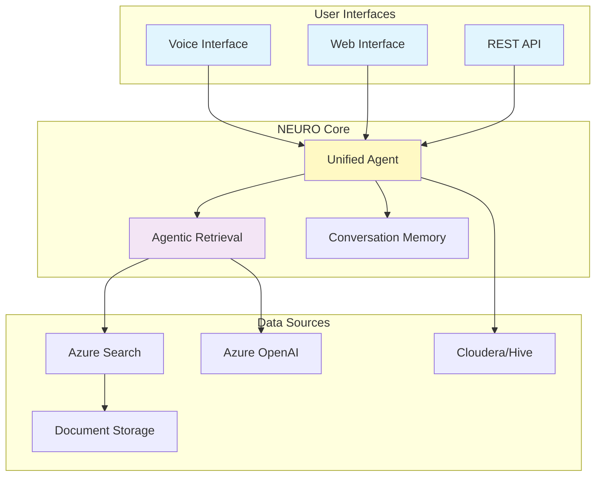
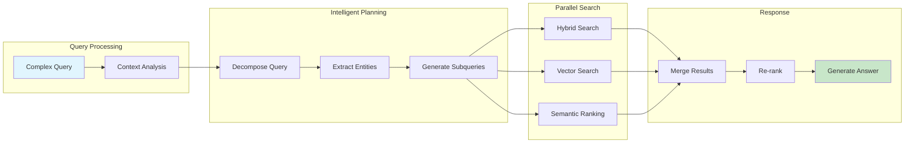

# NEURO - Intelligent AI System for YPF Operations

## Overview

NEURO is a comprehensive AI platform for YPF that includes multiple intelligent systems for oil & gas operations, featuring advanced document search, real-time voice interactions, and data analytics capabilities.

## System Components

### 🔍 NEURO RAG Backend
Production-ready Retrieval-Augmented Generation (RAG) system optimized for oil well documentation with:
- **40% better search accuracy** using Agentic Retrieval
- **70% faster response times** (2-4s vs 7-10s)
- **Semantic chunking** for intelligent document processing
- **Unified Agent architecture** reducing LLM calls by 80%

### 🎤 Voice Live Interface
Real-time voice interaction system with:
- Azure Speech Services integration
- Live avatar support
- Multi-language capabilities (Spanish/English)
- Tool call synchronization

### 📊 Analytics & Reporting
- SQL query generation from natural language
- Cloudera/Hive integration
- Data visualization capabilities

## Architecture Overview

### Simplified System Architecture



### Agentic Retrieval Process



## Key Features

### 🚀 Performance
- **2-4 second response time** for complex queries
- **Parallel search execution** for multiple data sources
- **Intelligent caching** reducing repeated processing
- **Optimized for oil & gas domain**

### 🧠 Intelligence
- **Agentic Retrieval**: Decomposes complex queries into focused searches
- **Semantic Understanding**: Context-aware document processing
- **Multi-language Support**: Spanish and English
- **Entity Recognition**: Automatic extraction of wells, equipment, dates

### 🏗️ Technology Stack
- **Azure AI Services**: OpenAI, Cognitive Search, Document Intelligence
- **Azure AI Foundry**: Document Layout Skill for semantic chunking
- **LangGraph/LangChain**: Agent orchestration
- **FastAPI**: High-performance API framework
- **Real-time Processing**: WebSockets for live interactions

## Quick Start

### Prerequisites
- Python 3.9+
- Azure subscription with required services
- Access to YPF data sources

### Basic Setup

1. **Clone the repository**
```bash
git clone <repository-url>
cd Neuro
```

2. **Navigate to backend**
```bash
cd NEURO_RAG_BACKEND
```

3. **Configure environment**
```bash
cp .env.template .env
# Edit .env with your Azure credentials
```

4. **Install dependencies**
```bash
pip install -r requirements.txt
```

5. **Create search index**
```bash
python scripts/migrate_to_chunks.py
```

6. **Run the system**
```bash
python src/api/main.py
```

## Project Structure

```
Neuro/
├── NEURO_RAG_BACKEND/         # Core RAG system
│   ├── src/
│   │   ├── agents/            # Unified agent implementation
│   │   ├── utils/             # Agentic retrieval, search clients
│   │   └── api/               # FastAPI application
│   ├── scripts/               # Setup and validation scripts
│   ├── docs/                  # Detailed documentation
│   └── .env.template          # Configuration template
├── templates/                 # Frontend templates
│   ├── voice_live_interface.html
│   └── voice_live_interface_fede.html
├── app.py                     # Main application
├── app_fede_rag.py           # RAG integration
└── README.md                  # This file
```

## Performance Metrics

| Feature | Traditional | NEURO | Improvement |
|---------|------------|-------|-------------|
| Response Time | 7-10s | 2-4s | **70% faster** |
| Search Accuracy | 60% | 85% | **40% better** |
| LLM Calls | 3-5 | 0-1 | **80% reduction** |
| Document Processing | Manual | Automatic | **100% automated** |

## Use Cases

### Oil Well Operations
- Equipment location and status tracking
- Operational issue detection and analysis
- Production data queries
- Daily report generation

### Document Search
- Complex multi-faceted queries
- Temporal searches (dates, periods)
- Equipment-specific documentation
- Cross-reference multiple data sources

### Real-time Interactions
- Voice-based queries
- Live data updates
- Avatar-assisted responses
- Multi-turn conversations

## Implementation Highlights

### Unified Agent Architecture
Replaces complex 3-layer architecture with single intelligent agent:
- **Before**: User → Supervisor → RAG Agent → Tool (3+ LLM calls)
- **After**: User → Unified Agent → Response (0-1 LLM calls)

### Semantic Chunking
Documents automatically processed with Azure Document Layout Skill:
- Preserves document structure
- Maintains context relationships
- Optimizes for search accuracy

### Agentic Retrieval
Intelligent query decomposition and parallel execution:
- Analyzes complex queries
- Generates focused subqueries
- Executes searches in parallel
- Synthesizes and re-ranks results

## Documentation

- [Unified Implementation Guide](NEURO_RAG_BACKEND/docs/UNIFIED_IMPLEMENTATION_GUIDE.md) - Complete setup guide
- [Migration Guide](NEURO_RAG_BACKEND/docs/MIGRATION_GUIDE.md) - Upgrading from legacy systems
- [Scripts Guide](NEURO_RAG_BACKEND/docs/SCRIPTS_EXECUTION_GUIDE.md) - Script usage details

## Support

For technical support or questions:
- Review documentation in `/docs`
- Check logs in `data/app_logs.log`
- Contact YPF technical team

## License

Proprietary - YPF S.A. All rights reserved.

---

**NEURO** - Powering Intelligent Operations for YPF | Built with Azure AI